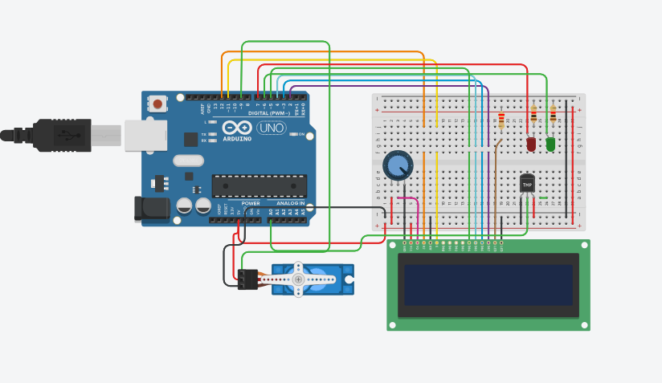

### Ezequiel Fleitas
#  2do Parcial SPD - Sistema de Incendio

## Proyecto: Sistema de incendio con Arduino



### Descripción
Se diseño un sistema de incendio donde se utilza Arduino que va a detectar cambios de temperatura y activar un servo motor en caso de detectar un incendio.
Además, se mostrará la temperatura actual y la estación del año en un display LCD.

### Función Principal

1.Incluye las bibliotecas necesarias: 
* Las bibliotecas LiquidCrystal.h y Servo.h permiten el uso de una pantalla LCD y un servo motor, respectivamente.
```c++
    #include <LiquidCrystal.h>
    #include <Servo.h>
```
2.Define las constantes y variables:
```c++
    #define led_rojo 7
    #define led_verde 6
    #define SensorIR 8Servo servitox;
    int TMP = 0;
    float temperatura = 0;
    bool servoMovido = false;
```
3.Crea un objeto LiquidCrystal para controlar la pantalla LCD:
* El constructor LiquidCrystal recibe los pines correspondientes a RS, E, D4, D5, D6 y D7 de la pantalla LCD.
```c++
    LiquidCrystal lcd_1(12, 11, 5, 4, 3, 2);
```
4.En la función setup(), se configuran los pines como entrada o salida y se inicializa el LCD:
* pinMode() se utiliza para configurar los pines de los LEDs como salidas.
* servitox.attach() se utiliza para adjuntar el servo motor al pin 9 y se establecen los límites de pulso.
* lcd_1.begin(20, 2) inicializa el LCD con 20 columnas y 2 filas.
* lcd_1.clear() limpia el contenido del LCD.
```c++
void setup() {
    pinMode(led_rojo, OUTPUT);
    pinMode(led_verde, OUTPUT);
    servitox.attach(9, 500, 2500);
    lcd_1.begin(20, 2);
    lcd_1.clear();
}
```
5.La función loop() se ejecuta continuamente. Primero, se lee la temperatura y se muestra en el LCD:
* analogRead(TMP) lee el valor analógico del pin TMP y se mapea a un rango de temperatura.
* lcd_1.setCursor(0, 1) establece la posición del cursor en la segunda línea del LCD.
```c++
void loop() {
    temperatura = map(analogRead(TMP), 0, 1023, -50, 450);
    lcd_1.setCursor(0, 1);
    lcd_1.print(temperatura);
    mostrarEstacion(temperatura);
}
```
6.La función mostrarEstacion() determina el estado y lo muestra en el LCD:
* Se establece la posición del cursor en la primera línea del LCD.
* Se utilizan las estructuras condicionales if y else if para determinar el estado según el rango de temperatura.
* Dependiendo del estado, se encienden o apagan los LEDs y se muestra un mensaje correspondiente en el LCD.
* Si la temperatura supera los 60 grados, se detiene el servo motor, se muestra el mensaje de incendio y se llama a la función moverServomotor() para mover el servo motor en un bucle.
```c++
void mostrarEstacion(float temperatura) {
    lcd_1.setCursor(0, 0);
    if (temperatura <= -11) {
        apagadoLosDos();
        lcd_1.print("................  ");
        servoMovido = false;
    }  
    else if (temperatura >= -10 && temperatura <= 9) {
        lcd_1.print("Invierno........ ");
        servoMovido = false;
        encendido();
    }
    else if (temperatura >= 10 && temperatura <= 20) {
        lcd_1.print("Otonio..........   ");
        servoMovido = false;
        encendido();
    }
    else if (temperatura >= 21 && temperatura <= 28) {
        lcd_1.print("Primavera.......");
        servoMovido = false;
        encendido();
    }
    else if (temperatura >= 29 && temperatura <= 35) {
        lcd_1.print("Verano..........   ");
        servoMovido = false;
        encendido();
    }
    else if (temperatura > 35 && temperatura < 60) {
        apagadoLosDos();
        lcd_1.print("................");
        servoMovido = false;
    }
    else if (temperatura >= 60) {
        if (!servoMovido) {
            apagado();
            lcd_1.clear();
            lcd_1.setCursor(0, 0);
            lcd_1.print("Hay un Incendio!");
            servoMovido = true;
            moverServomotor();
        }
    } 
    else {
        apagadoLosDos();
        lcd_1.clear();
    }
}
```
7.La función moverServomotor() controla el movimiento del servo motor:
* El servo motor se mueve en un bucle desde el ángulo 0 hasta el ángulo 180 y luego desde 180 hasta 0 con incrementos de 10 grados.
* Se utiliza la función servitox.write() para establecer el ángulo del servo motor.
* delay(500) se utiliza para pausar el movimiento del servo motor durante 500 milisegundos en cada ángulo.
```c++
void moverServomotor() {
  for (int angle = 0; angle <= 180; angle += 10) {
    servitox.write(angle);
    delay(500);
  }
  for (int angle = 180; angle >= 0; angle -= 10) {
    servitox.write(angle);
    delay(500);
  }
}
```
8.Las funciones apagado(), apagadoLosDos() y encendido() controlan los estados de los LEDs: 
* apagado() apaga el LED rojo y enciende el verde.
* apagadoLosDos() apaga ambos LEDs.
* encendido() enciende el LED verde y apaga el rojo.
```c++
void apagado() {
  digitalWrite(led_rojo, HIGH);
  digitalWrite(led_verde, LOW);
}
void apagadoLosDos() {
  digitalWrite(led_rojo, LOW);
  digitalWrite(led_verde, LOW);
}
void encendido() {
  digitalWrite(led_rojo, LOW);
  digitalWrite(led_verde, HIGH);
}
```
### Link del proyecto
[tinkercad.com](https://www.tinkercad.com/things/axQ3Jpdl72C "Link al arduino")


